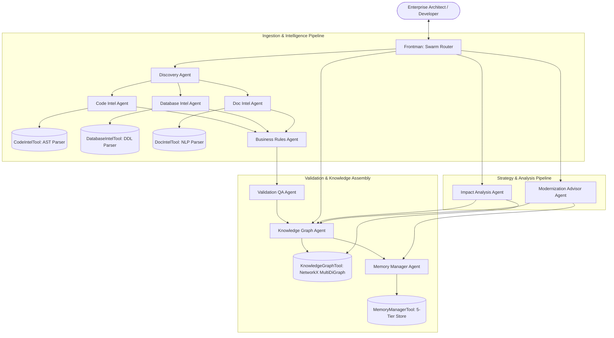
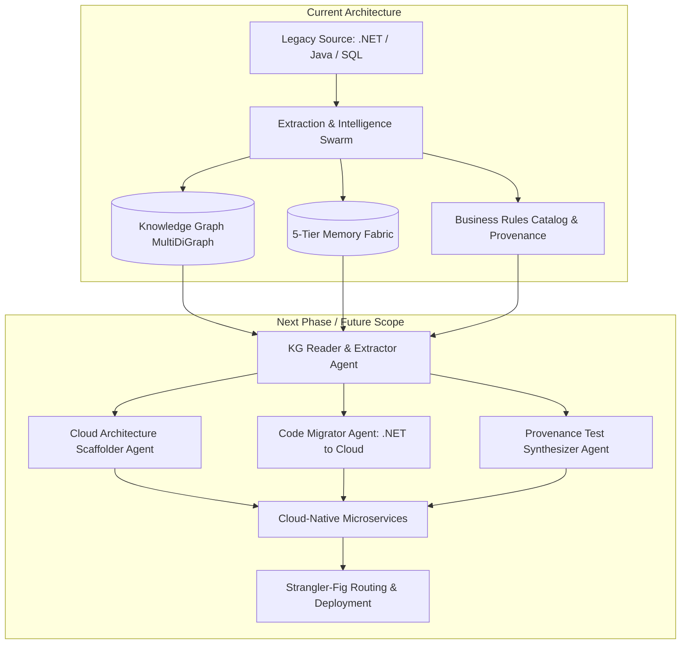

# ModernizeAI: Enterprise Legacy Modernization Platform
### *Powered by Neuro SAN Studio (Cognizant Neuro® AI Multi-Agent Accelerator)*

[](https://github.com/cognizant-ai-lab/neuro-san-studio)
[](https://www.python.org/)
[](docs/generated/MODERNIZE_AI_GUIDE.md)
[](docs/generated/MODERNIZE_AI_GUIDE.md)
[](#-future-roadmap-phase-2-active-code-migration--cloud-transformation)
[](LICENSE.txt)

---

## 🌟 What is ModernizeAI?

**ModernizeAI** is an enterprise-grade **Agentic Knowledge Factory** and **Hybrid Agentic Graph-RAG platform** built on the **Neuro SAN Studio** multi-agent orchestration framework. It is specifically engineered to solve the complexity, risk, and high failure rates associated with enterprise legacy application reverse-engineering and cloud migration.

ModernizeAI is architected around a strategic two-phase lifecycle:
* **Phase 1: Deterministic Reverse Engineering & Knowledge Graph Creation (Current Focus)**: Extracts verified ground truth via AST parsers, SQL schema analyzers, and documentation NLP, synthesizing intelligence into an enriched 5-Tier Memory Fabric and schema-enforced MultiDiGraph.
* **Phase 2: Knowledge-Graph-Driven Code Migration Swarm (Future Scope)**: Deploys autonomous migration agents that ingest the Knowledge Graph to execute automated code transformation, transpilation (e.g., legacy .NET to cloud-native microservices), and provenance-grounded regression test generation.

Traditional legacy modernization projects experience a **70%+ failure or delay rate** because organizations attempt code migration before deeply understanding legacy business logic, transitive database locks, and hidden side effects. ModernizeAI solves this by strictly enforcing the **80/20 Principle**:

* **80% Deterministic Extraction**: Abstract Syntax Tree (AST) code parsers, regex symbol extractors, SQL/DDL interpreters, and database schema analyzers extract concrete facts, method signatures, foreign keys, and line-level provenance **without LLM hallucination**.
* **20% LLM Agent Reasoning**: Large Language Models orchestrated via Neuro SAN are applied strictly where semantic disambiguation is required—interpreting legacy documentation and SME notes, discovering implicit business rules, calculating blast radiuses, formulating 6R cloud migration strategies, and answering natural language architecture queries.

---

## 🧩 How ModernizeAI is Built from Neuro SAN Studio

ModernizeAI serves as a production-grade showcase of what can be built using **Neuro SAN Studio**:

1. **Declarative Multi-Agent Configuration**: ModernizeAI's entire 11-agent network is defined declaratively using HOCON in [`registries/generated/modernizeai.hocon`](registries/generated/modernizeai.hocon).
2. **Autonomous Agent Coordination ([AAOSA Protocol](https://arxiv.org/abs/cs/9812015))**: Agents dynamically collaborate, hand off subtasks, and route intelligence through an autonomous conversational network led by the `Frontman` agent.
3. **Custom Coded Tools Ecosystem**: Equipped with 5 high-speed deterministic tools located in [`coded_tools/modernize/`](coded_tools/modernize/) that execute AST parsing, DDL parsing, document NLP, NetworkX graph modeling, and 5-tier memory persistence.
4. **Sly-Data Protection**: Utilizes Neuro SAN's Sly-Data capabilities to safely handle sensitive database credentials, enterprise schemas, and source code without exposing raw proprietary data directly to LLM context windows.

---

## 🏛️ ModernizeAI Swarm Architecture

ModernizeAI coordinates an **11-Agent Mixture-of-Experts Swarm** supported by **5 Coded Tools** and a **5-Tier Memory Fabric**:



### Swarm Agent Specification

| Agent Name | Role & Responsibility | Neuro SAN Tools & Downstream Agents |
| :--- | :--- | :--- |
| **`frontman`** | Main entry point; parses user intents and coordinates swarm workflows. | `discovery_agent`, `impact_analysis_agent`, `knowledge_graph_agent`, `modernization_advisor_agent` |
| **`discovery_agent`** | Catalogs file trees across code, SQL, and documentation directories. | `code_intel_agent`, `database_intel_agent`, `doc_intel_agent` |
| **`code_intel_agent`** | Deterministic AST parsing of Java and application source code. | `code_intel_tool`, `business_rules_agent` |
| **`database_intel_agent`** | Schema parsing of SQL DDLs, tables, constraints, and stored procedures. | `database_intel_tool`, `business_rules_agent` |
| **`doc_intel_agent`** | Semantic and structural extraction of architectural specs and SME notes. | `doc_intel_tool`, `business_rules_agent` |
| **`business_rules_agent`**| Formalizes and cataloges cross-system enterprise business logic. | `validation_agent` |
| **`validation_agent`** | Quality assurance agent verifying source provenance and eliminating hallucinations. | `knowledge_graph_agent` |
| **`knowledge_graph_agent`**| Traverses and enriches the schema-enforced MultiDiGraph knowledge fabric. | `knowledge_graph_tool`, `memory_manager_agent` |
| **`memory_manager_agent`**| Manages 5-tier memory persistence, vector search, and BM25 index retrieval. | `memory_manager_tool` |
| **`impact_analysis_agent`**| Computes dependency blast radiuses and risk-classified ripple effects. | `knowledge_graph_agent`, `knowledge_graph_tool` |
| **`modernization_advisor_agent`** | Analyzes system coupling ($C_a, C_e, I$) and recommends 6R cloud migration strategies. | `knowledge_graph_agent`, `memory_manager_agent` |

---

## 🧠 5-Tier Memory Fabric

ModernizeAI replaces standard single-prompt RAG with a structured five-tier memory fabric:

| Tier | Tier Name | Purpose & Persistence | Key Capabilities |
| :---: | :--- | :--- | :--- |
| **1** | **Raw Memory** | Ingested source files with SHA-256 hashes and line-offset indices. | 100% verifiable citations down to exact source line numbers. |
| **2** | **Structural Memory** | Deterministic symbol tables, AST nodes, DDL schemas, and call graphs. | Sub-millisecond exact queries for classes, methods, and foreign keys. |
| **3** | **Semantic Memory** | Vector embeddings and BM25 search over specifications and SME notes. | Semantic concept matching, synonym expansion, and intent lookup. |
| **4** | **Procedural Memory** | Reusable extraction recipes, regex patterns, and traversal algorithms. | Dynamic pattern reuse across different legacy frameworks and dialects. |
| **5** | **Transformation Memory**| 6R migration classifications, coupling metrics, and community detection. | Microservice candidate clustering, blast radius, and migration roadmaps. |

---

## 🚀 Future Roadmap: Phase 2 Active Code Migration & Cloud Transformation

While the **current architecture (Phase 1)** is centered on **reverse engineering, deterministic AST/schema extraction, and Knowledge Graph creation**, the **next phase (Phase 2)** introduces autonomous **Code Migration & Transformation Swarm Agents**.

Instead of stopping at architectural discovery and readiness reports, Phase 2 agents directly **ingest and traverse the verified Knowledge Graph and 5-Tier Memory Fabric** to perform end-to-end, automated code refactoring and cloud migration.



### Phase 2 Agent Network Specification

| Agent Name | Role & Responsibility | Upstream / Downstream Linkage |
| :--- | :--- | :--- |
| **`kg_reader_agent`** | Ingests, queries, and extracts subgraphs from the Knowledge Graph MultiDiGraph and 5-Tier Memory (AST symbol tables, call graphs, DDL schemas, formalized business rules). | Queries `knowledge_graph_tool` & `memory_manager_tool`; feeds `cloud_scaffolder_agent` & `code_migrator_agent`. |
| **`cloud_scaffolder_agent`** | Generates target cloud-native project scaffolding, dependency manifests, container configurations (Dockerfiles), and infrastructure blueprints (Kubernetes Helm charts, Terraform, serverless SAM templates). | Ingests candidate microservices from Louvain community detection (Domain 1–5). |
| **`code_migrator_agent`** | Executes deep syntax and semantic code transpilation and modernization. For example, converting legacy on-premise **.NET Framework (C# / WCF / ADO.NET)** applications to modern **cloud-native .NET 8/9, ASP.NET Core Minimal APIs, or Cloud Run / AWS Lambda services**. | Ingests AST symbol graphs and business rule specifications; produces modern modular code. |
| **`sql_to_cloud_agent`** | Decouples procedural stored procedures (e.g. PL/SQL / T-SQL row locks) and translates relational schemas into cloud-native data access layers (EF Core, Dapper, PostgreSQL, or DynamoDB/CosmosDB with Outbox/Saga patterns). | Modernizes database access based on DDL schemas and stored procedure ASTs. |
| **`test_synthesizer_agent`** | Automatically generates comprehensive unit, contract, and behavioral integration tests directly from formalized business rules (`BR-01` through `BR-05`) to mathematically guarantee zero behavioral regression. | Uses business rule source provenance to validate modernized code against legacy behavior. |
| **`strangler_deployer_agent`** | Orchestrates Strangler-Fig traffic migration, configuring API gateways (Azure APIM, AWS API Gateway, Envoy) to route traffic incrementally between legacy and modernized services. | Implements canary rollouts guided by the blast-radius dependency matrix. |

### Concrete Exemplar: Legacy .NET to Cloud Modernization

To illustrate how Phase 2 transforms enterprise legacy code:

1. **Legacy Input**: A monolithic on-premise .NET Framework 4.8 application utilizing legacy WCF endpoints, ADO.NET queries with hardcoded SQL, and synchronous stored procedures with table locks.
2. **Phase 1 Extraction (Completed)**: ModernizeAI extracts the C# AST, maps entity relationships to the Knowledge Graph, catalogs business rules with line-level provenance, and computes afferent/efferent coupling ($C_a, C_e$).
3. **Phase 2 Automated Migration**:
   * **Graph Extraction**: `kg_reader_agent` traverses the subgraphs corresponding to the isolated domain (e.g., Claim Settlement domain).
   * **Solution Scaffolding**: `cloud_scaffolder_agent` scaffolds a modern ASP.NET Core solution structured as containerized microservices with OpenTelemetry, health checks, and Dockerfile definitions.
   * **Code Transpilation**: `code_migrator_agent` translates legacy WCF controllers into RESTful OpenAPI/gRPC endpoints, replaces ADO.NET boilerplate with clean Entity Framework Core repositories, and re-implements validated business rules into modern domain logic.
   * **Automated Verification**: `test_synthesizer_agent` generates xUnit/NUnit test suites grounded in legacy provenance to prove functional parity before deployment.

---

## 🖥️ Two Interactive User Interfaces

ModernizeAI provides two integrated user interfaces depending on your workflow:

### 1. ModernizeAI Dedicated Web Application
* **Location**: [`apps/modernizeai_ui/server.py`](apps/modernizeai_ui/server.py)
* **URL**: `http://localhost:8000`
* **Features**:
  * **One-Click Ingestion Pipeline**: Scan source repositories with real-time progress.
  * **5-Tier Memory & Graph Metrics**: Live counters for nodes, edges, business rules, and microservices.
  * **Interactive PyVis Knowledge Graph**: Embedded, zoomable 2D/3D visualizer with physics simulation.
  * **Transitive Blast Radius Explorer**: Live dependency impact analysis for any class or table.
  * **Artifacts Review Center**: Integrated viewer for Modernization Readiness Reports, Business Rules Catalogs, and Impact Matrices.
  * **Grounded AI Copilot**: Chat interface backed by verified code provenance.

```bash
# Launch ModernizeAI Web Application:
python apps/modernizeai_ui/server.py --port 8000
```

### 2. Neuro SAN Studio Client (`nsflow`)
* **Location**: Built-in Neuro SAN Studio Client
* **URL**: `http://localhost:4173/?network=generated%2Fmodernizeai`
* **Features**:
  * **Live Network Topology Visualizer**: Interactive React Flow diagram showing the 11 agents and 5 tool nodes.
  * **Multi-Agent Swarm Chat**: Chat directly with `Frontman` and inspect real-time inter-agent delegation.
  * **Execution Telemetry & Traces**: View full message passing, prompt token costs, and internal logs.

```bash
# Launch Neuro SAN Server + nsflow Studio UI:
ns run
```

---

## ⚡ Quickstart

### Prerequisites
* Python 3.11+
* [`uv`](https://docs.astral.sh/uv/) (recommended) or standard `pip` / `venv`
* LLM API Key (OpenAI, Anthropic, Google Gemini, or local models via Ollama)

### 1. Clone & Set Up Environment
```bash
git clone https://github.com/lijumat007-eng/ModernizeAI_Neuro_San_Studio.git
cd ModernizeAI_Neuro_San_Studio

# Using uv:
uv venv
source .venv/bin/activate  # On Windows: .venv\Scripts\activate
uv pip install -r requirements.txt
```

### 2. Configure Your API Key
Copy `.env.example` to `.env` and set your key:
```bash
cp .env.example .env
```
```env
OPENAI_API_KEY="your-api-key"
# or ANTHROPIC_API_KEY / GOOGLE_API_KEY
```

### 3. Run ModernizeAI

#### Option A: Dedicated Web Dashboard (Recommended)
```bash
python apps/modernizeai_ui/server.py --port 8000
```
Open [http://localhost:8000](http://localhost:8000) in your browser.

#### Option B: Neuro SAN Studio Swarm UI
```bash
ns run
```
Open [http://localhost:4173/?network=generated%2Fmodernizeai](http://localhost:4173/?network=generated%2Fmodernizeai).

#### Option C: Interactive CLI Runner
```bash
python scripts/run_modernize_cli.py
```

---

## 📂 Bundled Benchmark Application & Documentation

This repository includes a complete legacy enterprise benchmark application to demonstrate the platform out-of-the-box:

* **Analyzed Application Profile**: `ClaimCore v2.4` (Enterprise Property & Casualty Claims Processing Monolith).
* **Source Location**: [`data/insurance_claims_app/`](data/insurance_claims_app/)
  * Java domain models, DAO layers, and business rules.
  * Oracle SQL DDL schema definitions and stored procedures.
  * Architecture specifications and adjuster workflow notes.
* **Complete ModernizeAI Guide**: [`docs/generated/MODERNIZE_AI_GUIDE.md`](docs/generated/MODERNIZE_AI_GUIDE.md)
* **Benchmark Inventory & Data Points**: [`docs/generated/MODERNIZE_DEMO_DATA_POINTS.md`](docs/generated/MODERNIZE_DEMO_DATA_POINTS.md)
* **Generated Analysis Artifacts**:
  * [`artifacts/business_rules_catalog.md`](artifacts/business_rules_catalog.md)
  * [`artifacts/impact_blast_radius_matrix.md`](artifacts/impact_blast_radius_matrix.md)
  * [`artifacts/modernization_readiness_report.md`](artifacts/modernization_readiness_report.md)
  * [`artifacts/modernize_graph.html`](artifacts/modernize_graph.html) (Interactive PyVis Graph)

---

## 🔬 About the Underlying Framework: Neuro SAN Studio

ModernizeAI is powered by [**Neuro SAN Studio**](https://github.com/cognizant-ai-lab/neuro-san-studio), the hands-on playground and reference implementation for the [**Cognizant Neuro® AI Multi-Agent Accelerator**](https://www.cognizant.com/us/en/ai-lab).

Neuro SAN Studio provides:
* **HOCON-driven Declarative Orchestration**: Define complex multi-agent behaviors without boilerplate glue code.
* **Agent Network Designer (AND)**: Built-in meta-agents capable of generating new agent networks from natural language prompts.
* **Extensible Tool Bridge**: Native support for Python Coded Tools, MCP (Model Context Protocol), LangChain tools, and external agent ecosystems (CrewAI, Agentforce).
* **Enterprise Observability**: End-to-end telemetry, OpenTelemetry / Phoenix logging, and token cost analytics.

### Full Command Reference

| Command | Purpose |
| :--- | :--- |
| `ns init` | Scaffold a new starter project with configured LLM providers. |
| `ns run` | Start the Neuro SAN backend server and `nsflow` visual client. |
| `ns chat <agent>` | Chat with any agent network directly from your terminal. |
| `ns import` | Discover and import ready-to-run agent networks from the library. |
| `ns export` | Package an agent network into a shareable bundle. |
| `ns check-llm-keys` | Verify API key connectivity and format across configured providers. |
| `ns check-config` | Validate HOCON agent configurations and test model responsiveness. |

For deep dives into the underlying engine:
* [Neuro SAN User Guide](docs/user_guide.md)
* [Tutorial](docs/tutorial.md)
* [Developer Guide](docs/dev_guide.md)
* [Example Networks Catalog](docs/examples.md)

---

## 📜 License & Acknowledgments

This project is licensed under the Apache 2.0 License - see the [LICENSE.txt](LICENSE.txt) file for details.

Built with ❤️ using [Cognizant AI Lab Neuro SAN](https://github.com/cognizant-ai-lab/neuro-san).
