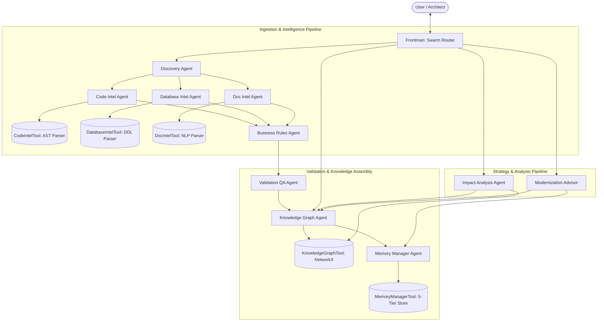
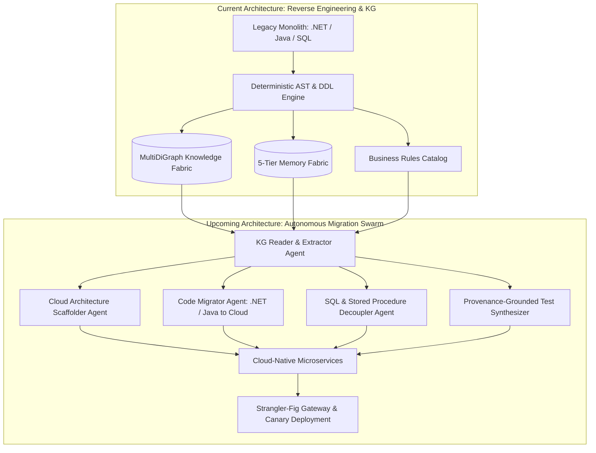

# ModernizeAI: Hybrid Agentic Graph-RAG Knowledge Fabric Guide

## 1. Overview & Vision

**ModernizeAI** is an Agentic Knowledge Factory and Hybrid Agentic Graph-RAG platform engineered to solve enterprise legacy application modernization and reverse engineering.

Traditional legacy modernization efforts frequently suffer from a 70%+ failure or delay rate because teams attempt to migrate code before deeply understanding legacy business rules, implicit database locks, and distributed side effects. ModernizeAI solves this through a structured two-phase approach:

* **Phase 1: Deterministic Reverse Engineering & Knowledge Graph Creation (Current Architecture)**: AST code parsers, regex symbol extractors, SQL/DDL interpreters, and schema analyzers extract concrete facts, method signatures, foreign keys, and line provenance without LLM hallucination, assembling a rich 5-Tier Memory Fabric and schema-enforced MultiDiGraph.
* **Phase 2: Knowledge-Graph-Driven Code Migration Swarm (Next Phase / Future Scope)**: Autonomous agents ingest and read the Knowledge Graph to execute automated code transformation, transpile legacy monoliths (e.g., .NET to cloud-native microservices), decouple monolithic database locks, and generate regression test suites.

ModernizeAI strictly enforces the **80/20 Principle**:
- **80% Deterministic Extraction**: AST code parsers, regex symbol extractors, SQL/DDL interpreters, and schema analyzers extract concrete facts, method signatures, foreign keys, and line provenance without LLM hallucination.
- **20% LLM Reasoning**: Large Language Models are applied strictly where semantic disambiguation is required—such as interpreting unstructured SME interview notes, resolving documentation-vs-code discrepancies, formulating 6R migration strategies, and answering natural-language architectural questions.

---

## 2. The Two User Interfaces

ModernizeAI provides two distinct user interfaces designed for different workflows:

### A. Neuro SAN Studio Client (`nsflow`)
- **Location**: Built-in Neuro SAN Studio Client
- **URL**: [http://localhost:4173/?network=generated%2Fmodernizeai](http://localhost:4173/?network=generated%2Fmodernizeai)
- **Primary Use Case**: Multi-Agent Orchestration & Network Topology Inspection
- **Features**:
  - **Live Topology Diagram**: Interactive React Flow visualizer rendering the 11 agent nodes, 5 coded tool nodes, and directed communication edges.
  - **Agent Swarm Chat**: Chat directly with `Frontman` and watch real-time task delegation across specialist agents.
  - **Internal Chat & Telemetry**: Live stream of inter-agent delegation protocols, reasoning traces, and token costs.
  - **Sly-Data Inspector**: View sensitive data structures exchanged safely outside LLM context windows.

```bash
# Start Neuro SAN Server + nsflow Studio UI:
ns run
```

---

### B. ModernizeAI Dedicated Web Application Dashboard
- **Location**: [apps/modernizeai_ui/server.py](file:///c:/Users/lijum/OneDrive/Documents/Copilot%20Projects/cog_nuero/neuro-san-studio-main/apps/modernizeai_ui/server.py)
- **Default URL**: [http://localhost:8000](http://localhost:8000)
- **Primary Use Case**: End-to-End Modernization Workspace & Knowledge Fabric Explorer
- **Features**:
  - **Ingest & Rebuild Button**: One-click triggering of the deterministic parsing and ingestion pipeline (`/api/scan`).
  - **5-Tier Memory & Graph Metrics**: Real-time counter cards showing active memory tiers, knowledge nodes, structural edges, formalized rules, and candidate microservices.
  - **Swarm Live Status Visualizer**: Interactive chips showing real-time agent execution status.
  - **Interactive PyVis Knowledge Graph**: Embedded, zoomable 2D/3D graph visualization with physics simulation (`/artifacts/modernize_graph.html`).
  - **Blast Radius Explorer**: Interactive query box to calculate transitive dependency impacts for any class or table.
  - **Artifacts Review Center**: Live tabbed viewer for generated Modernization Readiness Reports, Business Rules Catalogs, and Impact Matrices.
  - **Swarm Coordinator Chat**: Direct conversational query engine with source code citation grounding.

```bash
# Start ModernizeAI Web Application:
python apps/modernizeai_ui/server.py --port 8000
```

---

## 3. Architecture & Swarm Specification

ModernizeAI operates as an 11-Agent Mixture-of-Experts Swarm backed by 5 Coded Tools and 5 Memory Tiers.



### Agent Roles

| Agent | Responsibility | Assigned Tools |
| :--- | :--- | :--- |
| **`frontman`** | Initial point of contact; classifies queries and orchestrates the swarm. | `discovery_agent`, `impact_analysis_agent`, `knowledge_graph_agent`, `modernization_advisor_agent` |
| **`discovery_agent`** | Scans legacy source trees, catalogs files, and coordinates parsing. | `code_intel_agent`, `database_intel_agent`, `doc_intel_agent` |
| **`code_intel_agent`** | Deterministic AST parsing of Java/SQL source code (80% rule). | `code_intel_tool`, `business_rules_agent` |
| **`database_intel_agent`** | Deterministic parsing of schema DDLs, tables, columns, and stored procedures. | `database_intel_tool`, `business_rules_agent` |
| **`doc_intel_agent`** | Semantic and structural extraction of architecture docs and SME notes. | `doc_intel_tool`, `business_rules_agent` |
| **`business_rules_agent`**| Formalizes and numbers cross-system enterprise business rules. | `validation_agent` |
| **`validation_agent`** | Quality assurance agent verifying line-level provenance and catching hallucinations. | `knowledge_graph_agent` |
| **`knowledge_graph_agent`**| Assembles and traverses the schema-enforced MultiDiGraph knowledge fabric. | `knowledge_graph_tool`, `memory_manager_agent` |
| **`memory_manager_agent`**| Oversees 5-tier memory persistence and hybrid vector/BM25 retrieval. | `memory_manager_tool` |
| **`impact_analysis_agent`**| Executes blast-radius traversals and risk-classified dependency tracing. | `knowledge_graph_agent`, `knowledge_graph_tool` |
| **`modernization_advisor_agent`** | Computes coupling metrics and generates phased 6R cloud migration strategies. | `knowledge_graph_agent`, `memory_manager_agent` |

---

## 4. Five-Tier Memory Architecture

| Tier | Name | Persistence & Purpose | Key Capabilities |
| :---: | :--- | :--- | :--- |
| **1** | **Raw Memory** | Ingested source files with SHA-256 hashes and line-offset indices. | 100% verifiable source citation; prevents hallucinated references. |
| **2** | **Structural Memory** | Deterministic symbol tables, AST nodes, DDL schemas, and method calls. | High-speed exact lookups of classes, interfaces, and tables. |
| **3** | **Semantic Memory** | In-house vector embeddings and BM25 search over documentation and SME notes. | Semantic concept matching, intent search, and terminology resolution. |
| **4** | **Procedural Memory** | Reusable extraction heuristics, regex recipes, and traversal algorithms. | Dynamic pattern reuse for legacy dialects and custom coding standards. |
| **5** | **Transformation Memory** | 6R migration classifications, coupling metrics ($C_a, C_e, I$), and roadmaps. | Phased cloud migration plans, architectural scorecards, and audit reports. |

---

## 5. Execution Modes & CLI

In addition to both web UIs, ModernizeAI includes an interactive terminal runner:

```bash
# Run ModernizeAI CLI Runner
python scripts/run_modernize_cli.py
```

### Sample CLI & Swarm Queries
- *"Scan and ingest the legacy application in `data/insurance_claims_app`"*
- *"What modules and tables are impacted if `POLICY_MASTER` changes?"*
- *"What business rules govern insurance claim validation and deductibles?"*
- *"What candidate microservices are identified by community detection?"*
- *"Generate modernization readiness report and interactive knowledge graph visualization"*

---

## 6. Future Scope & Roadmap: Phase 2 Active Code Migration Swarm

### 6.1 Architectural Transition: From Passive Discovery to Active Code Transformation

The **current implementation (Phase 1)** of ModernizeAI focuses comprehensively on **reverse engineering, deterministic fact extraction, and Knowledge Graph synthesis**. It equips enterprise teams with:
- Deterministic AST code parsing (Java, C#/.NET, SQL DDL, PL/SQL)
- Unambiguous line-level business rule catalogs
- 5-Tier Memory Fabric persistence (Raw, Structural, Semantic, Procedural, Transformation)
- Schema-enforced MultiDiGraph with Louvain community detection and blast-radius dependency tracing

The **next phase (Phase 2)** bridges the gap between architectural intelligence and concrete execution by introducing **Active Code Migration & Cloud Transformation Swarm Agents**. 

Instead of treating the Knowledge Graph as a static visualization, Phase 2 agents autonomously **ingest, query, and extract subgraphs** from the graph to scaffold target cloud architectures, transpile legacy codebases, decouple procedural database locks, and generate automated regression test suites.



### 6.2 Knowledge Graph Ingestion & Traversal Pipeline

Phase 2 introduces the **`kg_reader_agent`** supported by graph traversal tools:
1. **Bounded Context Subgraph Slicing**: Queries the Louvain community clusters (e.g., Domain 1–5 identified in Phase 1) to extract the exact boundary of classes, tables, and rules belonging to a candidate microservice.
2. **Provenance Traceability Retrieval**: Gathers raw code tokens, SHA-256 source line offsets, and AST symbol signatures from Structural and Raw Memory tiers.
3. **Context-Optimized Agent Payload Assembly**: Packages isolated dependency subgraphs into structured context windows for downstream code generation agents, bypassing LLM context window limits and hallucinations.

### 6.3 Code Migrator Agents: The .NET to Cloud Modernization Engine

A flagship capability of the Phase 2 swarm is automated legacy **.NET to Cloud** transformation:

* **Legacy Input**: Monolithic .NET Framework (4.x / C#) codebases relying on synchronous WCF/ASMX endpoints, direct ADO.NET SQL commands, and heavy database stored procedures.
* **Target Modern Architecture**: Cloud-native .NET 8/9 or Spring Boot / Quarkus containerized microservices hosted on AWS ECS/EKS, Azure Container Apps, or Google Cloud Run.
* **Transformation Operations**:
  1. **Controller & API Modernization**: Converts legacy WCF `.svc` contracts and SOAP handlers into modern RESTful ASP.NET Core Minimal APIs or gRPC services with OpenAPI/Swagger definitions.
  2. **Data Access Decoupling**: Replaces ADO.NET `SqlConnection` / `SqlCommand` blocks and table-locking queries with Entity Framework Core (EF Core) or Dapper repositories targeting cloud managed databases (PostgreSQL, Azure SQL, CosmosDB).
  3. **Stored Procedure Translation**: Refactors monolithic procedural SQL (such as `SP_PROCESS_CLAIM` with `SELECT FOR UPDATE` locks) into distributed asynchronous Saga orchestrators using Temporal or Step Functions with the Outbox pattern.
  4. **Domain Logic Re-implementation**: Directly injects the extracted, verified business rules (`BR-01` through `BR-05`) into clean domain models and validation pipelines (FluentValidation).

### 6.4 Provenance-Grounded Behavioral Regression Testing

To ensure modernization without unintended functional drift, the **`test_synthesizer_agent`**:
- Reads the deterministic business rule specifications and their exact line provenance.
- Generates exhaustive unit test suites (xUnit, NUnit, JUnit 5) verifying every boundary condition (e.g., $2,500 auto-approval limits, $50,000 fraud thresholds, policy grace periods).
- Synthesizes contract tests (Pact / Prism) ensuring API compatibility between legacy clients and modernized cloud endpoints.

### 6.5 Phased Roadmap Milestones

| Milestone | Scope & Capabilities | Target Deliverables |
| :---: | :--- | :--- |
| **Phase 1 (Current)** | Reverse Engineering & Knowledge Graph Creation | AST/DDL parsers, MultiDiGraph, 5-tier memory, Louvain clustering, Blast Radius matrices, Web Dashboard. |
| **Phase 2.1** | KG Reader & Context Slicing Engine | `kg_reader_agent`, sub-graph extraction tool, domain boundary exporter. |
| **Phase 2.2** | Automated Code Migrators (.NET & Java) | `code_migrator_agent`, `cloud_scaffolder_agent`, ASP.NET Core & Spring Boot 3 target generators. |
| **Phase 2.3** | Automated Regression & Contract Test Generation | `test_synthesizer_agent`, provenance-backed unit/integration test suites. |
| **Phase 2.4** | Strangler-Fig Gateway & Canary Deployment | `strangler_deployer_agent`, API gateway route generation (Kong, Envoy, Azure APIM). |

